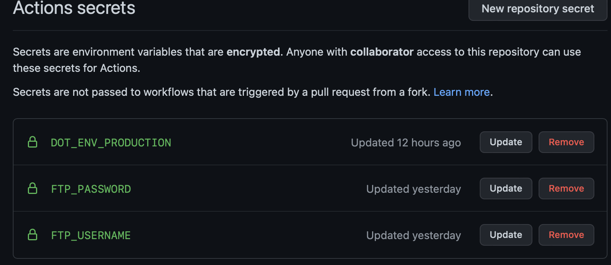

# Laravel FTP Deploy

Laravel FTP Deploy is a deployment guide for Laravel 9+ app. In guide, I describe how to implement simple ZIP deployment
to shared hosting, like WEDOS, how to set up it for correct usage and how to set up CICD (GitHub Actions Workflow), for
automatic deployment.

**Testen on WEDOS Shared Hosting**

- [Personal Website](https://jakubforman.eu/)
- [Company Website](https://awwwesome.cz/)
- [Custom Mobile App Website](https://foode.cz/)

Made by: Ing. Jakub Josef Forman (M.Sc.)

[](https://www.buymeacoffee.com/jakubforman)

## Why I created this guide?

1. Shared hosting is much cheaper than VPS.
2. Shared hosting on WEDOS have lots of power and good setup for Laravel apps (maybe simple aps).
3. ZIP upload is much faster than traditional file transport (basic Laravel project have about 24k files, but ZIP is
   only one file).
4. Used in my and our projects where we don't need VPS server.

## Requirements

- `PHP: 8.0.1+`
- `ZipArchive` PHP extension on server
- `zip` command in device shell (macOS or other unix / linux distribution)
- `league/flysystem-ftp` installed on `composer require`

## How it works

1. Get all files of your project (without excludes files or folders).
2. ZIP all together.
3. Deploy ZIP to FTP why setup in Laravel traditional way.
4. (Optionally) Migrate, fresh migrate and seed data (for seeder you need move `fakerphp/faker` from `require-dev` to `require`
   dependencies).

## What needs to do

1. Setup FTP in your Laravel project in `config/filesystems.php`. You can set up many servers as you want. _Also you
   need installed `composer require league/flysystem-ftp` (not in dev - for production, must be in production)_

```php
    'disks' => [
        // ... other code
        'production_ftp' => [
            'driver' => 'ftp',
            'host' => env('FTP_HOST'),
            'username' => env('FTP_USERNAME'),
            'password' => env('FTP_PASSWORD'),
        ]
    ]
```

2. Create new command for deploying in commands folder
    - Copy original [Console DeployFTP command](src/DeployFTP.php) and paste it in `app/Console/Commands/DeployFTP.php`,
      or you can reneame it
3. Update deploy script
    - Update `$excludes` as you want, if you need send empty folders to server like (storage/framework/sessions) you
      also need update `getDeploymentCode()` function to create your folders.

```php
    /**
     * @var array
     */
    protected array $excludes = [
        '.idea',
        '.phpunit.result.cache',
        '.DS_Store',
        '.editorconfig',
        '.gitattributes',
        '.git/*',
        '.github/*',
        '.scribe/*',
        '.env',
        'storage/app/*',
        'storage/logs/*',
        'storage/framework/cache/*',
        'storage/framework/sessions/*',
        'storage/framework/views/*',
        '.htaccess', // only for FTP shared hosting, original still exist
        'public/.htaccess', // only for FTP shared hosting, original still exist
        'public/index.php' // only for FTP shared hosting, original still exist
    ]; 
```

```php
    /**
     * return php deployment script code for unzipping archive and deleting old file
     *
     * Replacing content for WEDOS hosting
     * @return string
     */
    private function getDeploymentCode()
    {
        return '
            <?php
            // vars
            $archive = \'../' . static::ARCHIVE_NAME . '\';
            $zip = new ZipArchive;

            $res = $zip->open($archive);

            if ($res === TRUE) {
                // .... other code
                echo "complete";
            } else {
                echo "error";
            }';
    }
```

4. Update deploy script 2 - If you don't want to replace composer php checker version, remove or set as return empty
   string function `replaceMinPHPVersionOnHosting()` - this function is used for some hosting when you can't update PHP
   to needed version. Updating `/vendor/composer/platform_check.php` this file.

```php
    /**
     * Replace content for WEDOS hosting
     * @return string
     */
    function replaceMinPHPVersionOnHosting(): string
    {
        return '
              // REPLACE content for WEDOS!
              $content = file_get_contents("../vendor/composer/platform_check.php");
              $content = str_replace("80002", \'80001\', $content);
              file_put_contents("../vendor/composer/platform_check.php", $content);
        ';
    }
```

5. Run Command for deploy
    - For run you can use simple command (`php` or `sail` - if you run locally) `sail artisan deploy:server production_ftp`
      `production_ftp` is defined in 1. Setup FTP!
6. (optional) Automatic Migrate, Migrate Fresh and Seeder.
    - Open `routes/web.php` and add this route. Route is protected by `MIGRATION_HASH` `env` variable which is generated
      automatically before script zipping and sending files to FTP server and automatically added to `.env`.

```php
/**
 * FTP Migration & seeder tool
 */
Route::get('migrate', function (Request $request) {
    if ($request->has('hash')) {
        if ($request->input('hash') == env('MIGRATION_HASH')) {
            // WEDOS Artisan::call() fix
            if (!defined('STDIN')) {
                define('STDIN', fopen("php://stdin", "r"));
            }

            // generate command
            $cmd = 'migrate';
            if ($request->has('fresh')) {
                $cmd = 'migrate:fresh';
            }

            // migrate
            $migrateCode = Artisan::call($cmd, [
                '--force' => true
            ]);

            // seed
            $seedCode = null;
            if ($request->has('seed')) {
                $seedCode = Artisan::call('db:seed', [
                    '--force' => true
                ]);
            }
            return "Migration & seed status<br>
                    [migration code: $migrateCode, seed code: $seedCode]";
        }

        return 'Hash mishmash!';
    } else {
        return 'You don\'t have permissions to do that!';
    }
});
```

## CICD Setup

Basic setup for CICD

1. Setup GitHub Actions Secrets (`DOT_ENV_PRODUCTION`, `ftp_username`, `ftp_password`), also you can set up server and
   so on... This setup will be used in our [DeployFTP command](src/DeployFTP.php) for transfer ZIP file. _I setup FTP
   login as separated ENV variables, because I don't need it in production `.env` file._
   
2. Setup workflow - First setup .env file from your secret (you can also use another way), then deploy via
   our [DeployFTP command](src/DeployFTP.php) to your destination. _You can visit own
   simple [master.yml GitHub Workflow](src/master.yml)_

```yml
## Test, Build Release
## ... Other code

# copy .env from secrets
- name: Create .env file from secrets
  run: |
    touch .env
    printf '${{ secrets.DOT_ENV_PRODUCTION }}' > .env

# deploy to FTP server
- name: Deploy files to FTP
  env:
    FTP_HOST: xxxxxx.xx.xxxxxx.net
    FTP_USERNAME: ${{ secrets.ftp_username }}
    FTP_PASSWORD: ${{ secrets.ftp_password }}
    ENV_DEPLOY: true
  run: php artisan deploy:server production_ftp 
```

## WEDOS & Other shared hosting FIXS

For error where you want to run `Artisan::call()` with `migrate` command, and see error like
this `SQLSTATE[42000]: Syntax error or access violation: 1071 Specified key was too long; max key length is 767 bytes`
you can set custom Schema string length or update it manually in migration.

```php
<?php

// ... other code
use Illuminate\Support\Facades\Schema;

class AppServiceProvider extends ServiceProvider
{
    // ... other code
    public function boot()
    {
        // ... other code
        // FIX WEDOS ERROR
        // SQLSTATE[42000]: Syntax error or access violation: 1071 Specified key was too long; max key length is 767 bytes
        Schema::defaultStringLength(766);
    }
}
```


